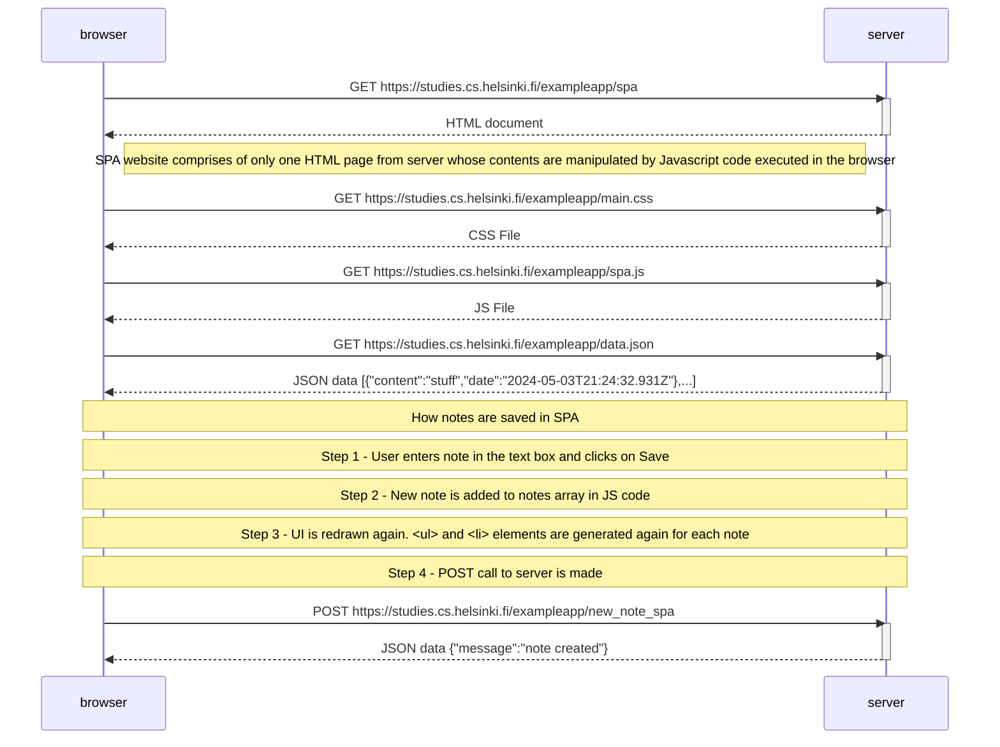

```mermaid
sequenceDiagram
    participant browser
    participant server

    browser->>server: GET https://studies.cs.helsinki.fi/exampleapp/spa
    activate server
    server-->>browser: HTML document
    deactivate server

    Note right of browser: SPA website comprises of only one HTML page from server whose contents are manipulated by Javascript code executed in the browser

    browser->>server: GET https://studies.cs.helsinki.fi/exampleapp/main.css
    activate server
    server-->>browser: CSS File
    deactivate server

    browser->>server: GET https://studies.cs.helsinki.fi/exampleapp/spa.js
    activate server
    server-->>browser: JS File
    deactivate server

    browser->>server: GET https://studies.cs.helsinki.fi/exampleapp/data.json
    activate server
    server-->>browser: JSON data [{"content":"stuff","date":"2024-05-03T21:24:32.931Z"},...]
    deactivate server

    Note over server,browser: How notes are saved in SPA
    
    Note over server,browser: Step 1 - User enters note in the text box and clicks on Save

    Note over server,browser: Step 2 - New note is added to notes array in JS code

    Note over server,browser: Step 3 - UI is redrawn again. <ul> and <li> elements are generated again for each note

    Note over server,browser: Step 4 - POST call to server is made

    browser->>server: POST https://studies.cs.helsinki.fi/exampleapp/new_note_spa
    activate server
    server-->>browser: JSON data {"message":"note created"}
    deactivate server
```